# Technical Design Document: Smart Counselor Routing
**Project:** MindBridge — AI-Powered Mental Health Backend
**Feature:** Smart Counselor Routing (Sticky Routing, Context Matching & Automated Context Passing)
**Author:** Technical Lead
**Status:** Ready for Implementation

---

# 1. Project Overview

## 1.1 Core Project Summary

MindBridge is a production-grade, AI-powered mental health backend API built on **FastAPI (Python 3.11+)** with **MongoDB** as its primary datastore. Its central value proposition is a multi-model AI pipeline that provides empathetic, real-time chat support to users — primarily via an Android client — while operating under strict safety constraints.

The pipeline works as follows: every user message is simultaneously processed by a **RoBERTa** classifier (for 28 fine-grained emotion labels) and a **Groq/Llama-3** safety consensus engine. If the consensus engine flags a `is_crisis: True` signal, the system immediately terminates the AI stream, marks the session as `is_escalated: True` in MongoDB, and broadcasts to a WebSocket room where a live human counselor can intervene. If no counselor joins within 3 minutes, an automated crisis hotline message is served and the AI resumes. A global 35-minute inactivity watchdog closes stale escalations.

## 1.2 The Problem with the Current Escalation System

The existing escalation mechanism is a **generic broadcast** — when a crisis is detected, the system opens a WebSocket room and pings any available counselor indiscriminately. This creates three critical failures in continuity of care:

1. **No Therapeutic Relationship Preservation:** A user who has built rapport with a specific counselor over several sessions will be routed to a random stranger, forcing them to re-establish trust in the middle of a crisis.
2. **No Context-Aware Assignment:** A counselor specialising in anxiety disorders may be assigned to a user currently experiencing suicidal ideation — a dangerously misaligned handoff.
3. **No Automated Briefing:** The new counselor enters the chat with zero context, forcing the distressed user to re-narrate their trauma from the beginning.

## 1.3 How Smart Counselor Routing Solves This

The **Smart Counselor Routing** module replaces the blunt broadcast with a three-tier intelligent decision engine:

| Tier | Mechanism | Purpose |
|------|-----------|---------|
| **Tier 1** | Sticky Routing | Route to the user's last known, trusted counselor |
| **Tier 2** | Context Matching | Validate that the past relationship is relevant to the current crisis category |
| **Tier 3** | Availability Gate | Confirm the preferred counselor is online and has capacity |

If the preferred counselor fails any tier check, the system falls back to a pool-based search for the next best available counselor. In either case — preferred or fallback — a **LLM-generated clinical handoff summary** is automatically pushed exclusively to the counselor's WebSocket feed before the user can see them typing. This ensures the counselor is briefed in 2–4 seconds without the user ever being asked to repeat themselves.

---

# 2. Project Structure Updates

## 2.1 New Files to Create

| File Path | Type | Purpose |
|-----------|------|---------|
| `app/services/routing_service.py` | New Service | Houses the entire 3-tier routing decision engine (`route_crisis_session`, `find_available_counselor`, `check_counselor_availability`, `evaluate_context_match`) |
| `app/services/summarization_service.py` | New Service | Manages all LLM prompts and API calls dedicated to generating clinical handoff summaries (`generate_clinical_handoff`) |

## 2.2 Existing Files with Significant Changes

| File Path | Change Severity | Nature of Change |
|-----------|-----------------|------------------|
| `app/models/db.py` | **High** | Schema additions to `UserModelDB`, `AdminModelDB`, and `SessionModelDB` to support routing relationships, presence tracking, and crisis categorization |
| `app/api/routes/chat.py` | **Medium** | Replace the single `await escalate_session(...)` call with an `asyncio.create_task(route_crisis_session(...))` background dispatch, and pass `consensus` data downstream |
| `app/api/routes/human.py` | **High** | Add counselor presence tracking (online/offline toggle on WebSocket connect/disconnect), session counter management, and pre-connection handoff summary injection |

## 2.3 Pre-existing Bugs That Must Be Fixed Before This Feature

Before implementing Smart Routing, the following bugs from the architectural analysis **must be patched**, as they will directly undermine the new feature's data integrity:

- **`app/api/routes/assessment.py`:** Restore the `$or` ObjectId query — without it, `personality_summary` never gets written, corrupting the user profiles the router reads.
- **`app/core/auth/token_blacklist.py`:** Migrate from synchronous `pymongo` to async `Motor` — the routing engine makes multiple concurrent DB calls and a blocking event loop will cause deadlocks.
- **`app/api/routes/human.py` (line 488):** Wrap the `find_one` call in a `try/except` with a `1011` WebSocket close code — the new routing logic adds more DB calls to this file, raising the blast radius of any unhandled DB exception.

---

# 3. Architecture Flow

```mermaid
graph TD
    A["User sends message"] --> B["RoBERTa emotion analysis\n+ Groq safety consensus"]
    B --> C{"Crisis detected?\nis_crisis == True"}

    C -- "No" --> D["Stream AI response\nvia SSE"]
    C -- "Yes" --> E["Terminate AI stream\nMark session as escalated"]

    E --> F["asyncio.create_task:\nroute_crisis_session()"]

    F --> G["Fetch user doc\nfrom MongoDB"]
    G --> H{"preferred_counselor_id\nexists?"}

    H -- "No" --> P["FALLBACK:\nPool Search"]
    H -- "Yes" --> I["Fetch preferred\ncounselor admin doc"]

    I --> J{"Crisis categories\nmatch?"}
    J -- "No" --> P
    J -- "Yes" --> K{"Counselor is_online\n== True?"}

    K -- "No" --> P
    K -- "Yes" --> L{"current_active_sessions\n< max_concurrent_sessions?"}

    L -- "No" --> P
    L -- "Yes" --> M["DIRECT ROUTE\nto preferred counselor"]

    P --> Q["Query DB: find online\ncounselors with capacity"]
    Q --> R{"Available\ncounselors found?"}

    R -- "No" --> S["Serve crisis hotline\nmessage to user"]
    R -- "Yes" --> T["Select best match\nby fewest active sessions"]

    T --> U["generate_clinical_handoff()\nin background task"]
    U --> V["Fetch last escalated\nsession messages"]
    V --> W["Fetch current session\nAI conversation"]
    W --> X["Prompt GPT-4o:\nGenerate clinical brief < 150 words"]
    X --> Y["Save summary to\nsessions.handoff_summary"]

    M --> Z["Assign counselor ID\nto session doc"]
    Y --> Z

    Z --> AA["Update user doc:\npreferred_counselor_id\nlast_crisis_category"]
    AA --> AB["Notify counselor\nof new session"]

    AB --> AC["Counselor WebSocket\nconnects"]
    AC --> AD["Inject system_handoff_brief\nprivately to counselor"]
    AD --> AE["Increment counselor\ncurrent_active_sessions"]
    AE --> AF["Begin live session\nwith user"]

    AF --> AG{"Session ends\nor counselor disconnects"}
    AG --> AH["Decrement\ncurrent_active_sessions"]
    AH --> AI["Mark session\nis_escalated = False"]
```



---

# 4. Database Changes

## 4.1 Collection: `users` — `UserModelDB`

### Fields Added

```python
preferred_counselor_id: Optional[str] = None
last_crisis_category: Optional[str] = None
```

| Field | Type | Default | Why It's Needed |
|-------|------|---------|-----------------|
| `preferred_counselor_id` | `Optional[str]` | `None` | **Sticky Routing anchor.** After every resolved escalation, this field is written with the `admin_id` of the counselor who handled the session. On the next crisis, `routing_service.py` reads this first. This is the single source of truth for "who does this user trust?" |
| `last_crisis_category` | `Optional[str]` | `None` | **Context Match input.** Stores the Groq `consensus["category"]` string (e.g., `"suicidal_ideation"`, `"anxiety_attack"`) from the *previous* escalation. During Tier 2 of routing, this is compared against the *current* consensus category. A mismatch (e.g., past: `"anxiety"`, current: `"self_harm"`) bypasses the sticky route because the counselor's relationship may not be contextually appropriate. |

---

## 4.2 Collection: `admins` — `AdminModelDB`

### Fields Added

```python
is_online: bool = False
current_active_sessions: int = 0
max_concurrent_sessions: int = 3
last_ping: Optional[datetime] = None
```

| Field | Type | Default | Why It's Needed |
|-------|------|---------|-----------------|
| `is_online` | `bool` | `False` | **Availability Gate (Tier 3).** Set to `True` when a counselor's WebSocket connects to the system, and atomically reset to `False` on disconnect. The routing engine's availability query uses `{"is_online": True}` as its primary filter. Without this, the engine could route to offline counselors. |
| `current_active_sessions` | `int` | `0` | **Load Balancing.** Incremented by 1 when a counselor is confirmed as joined to a user's WebSocket room; decremented on disconnect or session close. Used in the fallback query: `{"current_active_sessions": {"$lt": max_concurrent_sessions}}`. Prevents overloading a single counselor with simultaneous crises. |
| `max_concurrent_sessions` | `int` | `3` | **Counselor Capacity Cap.** A configurable ceiling that the routing query checks against `current_active_sessions`. Defaults to 3, but can be adjusted per-counselor (e.g., senior counselors handling more cases). This field makes the load balancing threshold flexible without code changes. |
| `last_ping` | `Optional[datetime]` | `None` | **Heartbeat Staleness Detector.** Updated every time the counselor's WebSocket sends a ping frame. If `is_online == True` but `last_ping` is older than a configured threshold (e.g., 30 seconds), the routing engine can treat this counselor as stale/unreachable even if their `is_online` flag hasn't been cleared yet. This mitigates the race condition where a counselor loses internet without a clean WebSocket disconnect. |

---

## 4.3 Collection: `sessions` — `SessionModelDB`

### Fields Added

```python
assigned_counselor_id: Optional[str] = None
crisis_category: Optional[str] = None
handoff_summary: Optional[str] = None
```

| Field | Type | Default | Why It's Needed |
|-------|------|---------|-----------------|
| `assigned_counselor_id` | `Optional[str]` | `None` | **Session-Counselor Binding.** Written by `routing_service.py` after a counselor is selected (either preferred or fallback). This field is what `human.py` reads to validate that the counselor connecting via WebSocket is the *authorised* one for this session, preventing unauthorized counselors from joining a private crisis room. |
| `crisis_category` | `Optional[str]` | `None` | **Crisis Classification Storage.** The Groq consensus `category` for the current escalation is persisted here at the moment of crisis detection. This serves two purposes: (1) it is passed to `summarization_service.py` as part of the handoff prompt context, and (2) it becomes the source value written to `users.last_crisis_category` when the session is resolved, enabling future context matching. |
| `handoff_summary` | `Optional[str]` | `None` | **Pre-computed Clinical Brief.** The 150-word LLM-generated summary produced by `summarization_service.py` is saved here. When the counselor's WebSocket connects, `human.py` does a single `find_one` on the session document and reads this field directly — no second LLM call is needed. This decouples the slow summarization step from the real-time connection handshake. |

---

# 5. Codebase Changes (Step-by-Step)

## Step 0: Apply Pre-existing Bug Fixes (Prerequisite)

**WHY:** The Smart Routing engine makes multiple async MongoDB queries in rapid succession. If `token_blacklist.py` is still using synchronous PyMongo, every protected route verification will block the event loop during routing. Similarly, if the `assessment.py` ObjectId bug isn't fixed, `personality_summary` will be `None` for most users, causing the LLM prompts that inform the routing context to be incomplete.

**Actions:**
1. In `app/core/auth/token_blacklist.py`, replace `pymongo.MongoClient` with the `Motor` async client already used elsewhere in `app/core/`. Change `collection.find_one(...)` to `await collection.find_one(...)` and ensure the calling function is `async def`.
2. In `app/api/routes/assessment.py`, replace `{"user_id": user_id}` with `{"$or": [{"user_id": user_id}, {"_id": ObjectId(user_id)}]}` in the `update_one` filter.
3. In `app/api/routes/human.py` around line 488, wrap the bare `await db.sessions.find_one(...)` in a `try/except Exception`:
   ```python
   try:
       session_doc = await db.sessions.find_one({"session_id": session_id})
   except Exception as e:
       logger.error(f"DB error during WebSocket init: {e}")
       await websocket.close(code=1011, reason="Internal server error")
       return
   ```

---

## Step 1: Update Database Schemas in `app/models/db.py`

**WHY:** Pydantic models act as the schema contract between the application and MongoDB. Every new field the routing engine reads or writes must be declared here first; otherwise Motor will silently ignore fields on insertion and raise `KeyError` on reads.

**Actions:**

Add the following fields to the respective Pydantic model classes:

```python
# UserModelDB
class UserModelDB(BaseModel):
    # ... existing fields ...
    preferred_counselor_id: Optional[str] = None
    last_crisis_category: Optional[str] = None

# AdminModelDB
class AdminModelDB(BaseModel):
    # ... existing fields ...
    is_online: bool = False
    current_active_sessions: int = 0
    max_concurrent_sessions: int = 3
    last_ping: Optional[datetime] = None

# SessionModelDB
class SessionModelDB(BaseModel):
    # ... existing fields ...
    assigned_counselor_id: Optional[str] = None
    crisis_category: Optional[str] = None
    handoff_summary: Optional[str] = None
```

Run a one-time migration script (or use `$setOnInsert` + `$set` with `upsert=False`) to add default values to all existing documents in the three collections so existing records are compatible.

---

## Step 2: Create `app/services/summarization_service.py`

**WHY:** The LLM call to generate a clinical handoff summary is an expensive, latency-bound operation (2–4 seconds). Isolating it in its own service file means it can be called as a background `asyncio.Task` without blocking the routing engine or the user-facing SSE stream. It also keeps the prompt engineering logic out of the router layer, maintaining MVC separation.

**Actions:** Create the file with the following structure:

```python
# app/services/summarization_service.py
import openai
from app.core.db import db_manager

async def generate_clinical_handoff(user_id: str, current_session_id: str, crisis_category: str) -> str:
    """
    Generates a <150 word clinical handoff summary for a new counselor.
    Fetches the user's last escalated session (historical context) and
    current session (live AI conversation context), then synthesizes both.
    """
    db = db_manager.db

    # 1. Fetch historical context: the last resolved escalation with a counselor
    past_session = await db.sessions.find_one(
        {
            "user_id": user_id,
            "is_escalated": False,          # resolved sessions only
            "assigned_counselor_id": {"$ne": None}  # must have had a counselor
        },
        sort=[("created_at", -1)]           # most recent resolved session
    )

    past_messages = []
    if past_session:
        past_cursor = db.messages.find(
            {"session_id": past_session["session_id"]},
            sort=[("created_at", 1)]
        )
        past_messages = await past_cursor.to_list(length=30)

    # 2. Fetch current session: the live conversation with the AI
    current_cursor = db.messages.find(
        {"session_id": current_session_id},
        sort=[("created_at", 1)]
    )
    current_messages = await current_cursor.to_list(length=20)

    # 3. Format context strings for the prompt
    past_context_str = "\n".join(
        [f"{m['sender_type'].upper()}: {m['content']}" for m in past_messages]
    ) or "No prior escalation history found."

    current_context_str = "\n".join(
        [f"{m['sender_type'].upper()}: {m['content']}" for m in current_messages]
    ) or "No messages in current session."

    # 4. Build the clinical prompt
    system_prompt = (
        "You are a clinical handoff assistant for mental health professionals. "
        "Your job is to write a concise, third-person clinical briefing for a new counselor "
        "who is about to join an active crisis session. Do not include any preamble. "
        "Output only the briefing note. Keep it under 150 words."
    )

    user_prompt = (
        f"CRISIS CATEGORY: {crisis_category}\n\n"
        f"PRIOR SESSION HISTORY:\n{past_context_str}\n\n"
        f"CURRENT SESSION (AI Conversation Leading to Crisis):\n{current_context_str}\n\n"
        "Write the clinical handoff note now."
    )

    # 5. Call OpenAI GPT-4o
    client = openai.AsyncOpenAI()
    response = await client.chat.completions.create(
        model="gpt-4o",
        messages=[
            {"role": "system", "content": system_prompt},
            {"role": "user", "content": user_prompt}
        ],
        max_tokens=250,
        temperature=0.3   # low temperature for factual clinical output
    )

    summary = response.choices[0].message.content.strip()
    return summary
```

---

## Step 3: Create `app/services/routing_service.py`

**WHY:** This is the core orchestrator of the entire Smart Routing feature. By isolating it as a service, it can be called from `chat.py` as a fire-and-forget background task (`asyncio.create_task`). This means the user's SSE stream is never blocked waiting for the routing engine to complete its DB queries and LLM calls.

**Actions:** Create the file with the full 3-tier decision tree:

```python
# app/services/routing_service.py
import asyncio
import logging
from bson import ObjectId
from datetime import datetime
from app.core.db import db_manager
from app.services.summarization_service import generate_clinical_handoff

logger = logging.getLogger(__name__)


async def check_counselor_availability(counselor_doc: dict) -> bool:
    """Returns True if the counselor is online and has remaining capacity."""
    return (
        counselor_doc.get("is_online", False) and
        counselor_doc.get("current_active_sessions", 0) <
        counselor_doc.get("max_concurrent_sessions", 3)
    )


async def evaluate_context_match(current_category: str, last_category: Optional[str]) -> bool:
    """
    Returns True if the current crisis category is compatible with the
    counselor's last known context for this user.
    None last_category is treated as a match (no prior context to conflict with).
    """
    if last_category is None:
        return True
    return current_category == last_category


async def find_available_counselor(exclude_id: Optional[str] = None) -> Optional[dict]:
    """
    Pool-based fallback: finds the best available counselor by load.
    Excludes a specific counselor ID if provided (e.g., preferred was tried and failed).
    """
    db = db_manager.db
    query = {
        "is_online": True,
        "current_active_sessions": {"$lt": 3}
    }
    if exclude_id:
        query["_id"] = {"$ne": ObjectId(exclude_id)}

    # Sort by ascending active sessions (route to least-busy counselor first)
    cursor = db.admins.find(query).sort("current_active_sessions", 1).limit(1)
    results = await cursor.to_list(length=1)
    return results[0] if results else None


async def route_crisis_session(user_id: str, session_id: str, consensus: dict):
    """
    Main entry point called via asyncio.create_task() from chat.py.
    Implements the full 3-tier routing decision tree.
    """
    db = db_manager.db
    crisis_category = consensus.get("category", "unknown")
    assigned_counselor = None
    is_preferred_route = False

    try:
        # --- TIER 1: Sticky Routing ---
        user_doc = await db.users.find_one({"_id": ObjectId(user_id)})
        if not user_doc:
            logger.error(f"routing_service: user {user_id} not found.")
            return

        preferred_id = user_doc.get("preferred_counselor_id")

        if preferred_id:
            preferred_doc = await db.admins.find_one({"_id": ObjectId(preferred_id)})

            if preferred_doc:
                # --- TIER 2: Context Match ---
                context_ok = await evaluate_context_match(
                    crisis_category, user_doc.get("last_crisis_category")
                )

                if context_ok:
                    # --- TIER 3: Availability Gate ---
                    is_available = await check_counselor_availability(preferred_doc)
                    if is_available:
                        assigned_counselor = preferred_doc
                        is_preferred_route = True
                        logger.info(f"routing_service: preferred counselor {preferred_id} selected.")

        # --- FALLBACK: Pool Search ---
        if not assigned_counselor:
            logger.info("routing_service: falling back to pool search.")
            assigned_counselor = await find_available_counselor(
                exclude_id=preferred_id if preferred_id else None
            )

        if not assigned_counselor:
            # No counselors available at all — serve crisis hotline message
            logger.warning(f"routing_service: no counselors available for session {session_id}.")
            await db.messages.insert_one({
                "session_id": session_id,
                "sender_type": "system",
                "content": (
                    "We're sorry, no counselors are available right now. "
                    "If you are in immediate danger, please call the National Crisis Helpline: 988."
                ),
                "created_at": datetime.utcnow()
            })
            return

        counselor_id_str = str(assigned_counselor["_id"])

        # --- WRITE SESSION ASSIGNMENT ---
        await db.sessions.update_one(
            {"session_id": session_id},
            {"$set": {
                "assigned_counselor_id": counselor_id_str,
                "crisis_category": crisis_category
            }}
        )

        # --- GENERATE HANDOFF SUMMARY (non-blocking for preferred route too) ---
        # Run summarization in parallel — don't await it here, let it write to DB
        # when ready. The counselor WebSocket handler will read it on connection.
        if not is_preferred_route:
            asyncio.create_task(
                _run_summarization_and_save(user_id, session_id, crisis_category)
            )

        # --- UPDATE USER PROFILE ---
        await db.users.update_one(
            {"_id": ObjectId(user_id)},
            {"$set": {
                "preferred_counselor_id": counselor_id_str,
                "last_crisis_category": crisis_category
            }}
        )

        logger.info(
            f"routing_service: session {session_id} assigned to counselor {counselor_id_str}. "
            f"Preferred route: {is_preferred_route}"
        )

        # --- NOTIFY COUNSELOR (implementation depends on notification layer) ---
        # e.g., push a notification via FCM, internal signal, or WebSocket ping
        # to the counselor dashboard that a new session awaits them.
        await _notify_counselor(counselor_id_str, session_id, crisis_category)

    except Exception as e:
        logger.exception(f"routing_service: unhandled error for session {session_id}: {e}")


async def _run_summarization_and_save(user_id: str, session_id: str, crisis_category: str):
    """Internal helper that generates the summary and persists it."""
    try:
        db = db_manager.db
        summary = await generate_clinical_handoff(user_id, session_id, crisis_category)
        await db.sessions.update_one(
            {"session_id": session_id},
            {"$set": {"handoff_summary": summary}}
        )
        logger.info(f"routing_service: handoff summary saved for session {session_id}.")
    except Exception as e:
        logger.exception(f"routing_service: summarization failed for session {session_id}: {e}")


async def _notify_counselor(counselor_id: str, session_id: str, crisis_category: str):
    """
    Stub for counselor notification. Replace with FCM push, WebSocket signal,
    or counselor dashboard polling endpoint as appropriate for your infrastructure.
    """
    logger.info(
        f"routing_service: [NOTIFY] Counselor {counselor_id} paged for "
        f"session {session_id} (category: {crisis_category})."
    )
```

---

## Step 4: Modify `app/api/routes/chat.py` — Replace Escalation Trigger

**WHY:** The current `chat.py` calls a generic `await escalate_session(...)` synchronously in the SSE stream loop. This means the user's streaming response would stall for however long it takes the (now much more complex) routing engine to finish. By replacing it with `asyncio.create_task(...)`, the routing work happens entirely in the background and the SSE stream can close cleanly and immediately after sending the crisis acknowledgment chunk.

**Actions:**

Locate the crisis detection block inside the `stream_message` route handler (inside `POST /api/chat/stream`) and replace it:

```python
# BEFORE (generic, blocking):
if consensus.get("is_crisis") is True:
    await escalate_session(session_id=actual_session_id, user_id=user_id)

# AFTER (smart routing, non-blocking background task):
if consensus.get("is_crisis") is True:
    from app.services.routing_service import route_crisis_session

    asyncio.create_task(
        route_crisis_session(
            user_id=user_id,
            session_id=actual_session_id,
            consensus=consensus          # passes is_crisis, category, severity etc.
        )
    )

    # Immediately yield a user-facing acknowledgment via SSE before closing
    yield "data: {\"type\": \"crisis_acknowledged\", \"message\": \"Connecting you with support...\"}\n\n"
    return   # Close the SSE generator; routing happens in background
```

Also ensure `actual_session_id` (the resolved session ID after upsert/find) is in scope at the point of the crisis check — if it is currently computed after the crisis check, reorder accordingly.

---

## Step 5: Modify `app/api/routes/human.py` — Counselor Presence & Handoff Injection

**WHY:** The WebSocket endpoint is the final delivery point for the entire routing pipeline. This step handles two distinct responsibilities: (a) the **lifecycle hooks** that keep the `AdminModelDB` presence fields accurate in real time, and (b) the **handoff injection** that delivers the clinical summary exclusively to the counselor before they begin chatting.

### 5a. Presence Tracking on WebSocket Connect

At the top of the `ws_counselor_room` handler, after authenticating the counselor's JWT:

```python
# Mark counselor as online and increment session counter atomically
await db.admins.update_one(
    {"_id": ObjectId(counselor_id)},
    {
        "$set": {"is_online": True, "last_ping": datetime.utcnow()},
        "$inc": {"current_active_sessions": 1}
    }
)
```

### 5b. Handoff Brief Injection Before Joining User Room

After the session document is fetched (inside the fixed `try/except` block from Step 0):

```python
session_doc = await db.sessions.find_one({"session_id": session_id})

# Validate that this counselor is the authorised one for this session
assigned = session_doc.get("assigned_counselor_id")
if assigned and assigned != counselor_id_str:
    await websocket.close(code=4003, reason="Not authorised for this session")
    return

# Poll for handoff summary with a short backoff (summary may still be generating)
handoff_summary = session_doc.get("handoff_summary")
if not handoff_summary:
    for _ in range(5):       # retry up to 5 times, 1 second apart
        await asyncio.sleep(1)
        session_doc = await db.sessions.find_one({"session_id": session_id})
        handoff_summary = session_doc.get("handoff_summary")
        if handoff_summary:
            break

# Push summary privately to the counselor BEFORE joining the user-visible room
if handoff_summary:
    await websocket.send_json({
        "type": "system_handoff_brief",
        "content": handoff_summary,
        "crisis_category": session_doc.get("crisis_category", "unknown")
    })

# Now proceed with standard manager.connect() and user room joining
manager.mark_human_joined(user_id)
```

### 5c. Presence Cleanup on WebSocket Disconnect

Inside the `finally:` block of the WebSocket handler (create one if it doesn't exist):

```python
finally:
    await db.admins.update_one(
        {"_id": ObjectId(counselor_id)},
        {
            "$inc": {"current_active_sessions": -1}
        }
    )
    # Only set is_online = False if this was their last active session
    updated = await db.admins.find_one({"_id": ObjectId(counselor_id)})
    if updated and updated.get("current_active_sessions", 0) <= 0:
        await db.admins.update_one(
            {"_id": ObjectId(counselor_id)},
            {"$set": {"is_online": False, "current_active_sessions": 0}}
        )
    # Mark session as no longer escalated
    await db.sessions.update_one(
        {"session_id": session_id},
        {"$set": {"is_escalated": False}}
    )
```

### 5d. Heartbeat Ping Handler

Add a background ping loop inside the counselor WebSocket connection to keep `last_ping` fresh:

```python
async def _counselor_heartbeat(counselor_id: str, websocket: WebSocket):
    """Updates last_ping every 20 seconds while the WebSocket is open."""
    while True:
        try:
            await asyncio.sleep(20)
            await db.admins.update_one(
                {"_id": ObjectId(counselor_id)},
                {"$set": {"last_ping": datetime.utcnow()}}
            )
        except Exception:
            break  # WebSocket has closed; exit silently

# Launch alongside the main message loop:
asyncio.create_task(_counselor_heartbeat(counselor_id, websocket))
```

---

## Step 6: Create a Counselor Presence Toggle Endpoint (Optional REST Fallback)

**WHY:** WebSocket-only presence tracking breaks when a counselor's mobile device puts the app in the background (the OS may kill the WebSocket without a clean close frame). A REST-based `/api/counselor/online` endpoint gives the client app a heartbeat fallback that can be called even when the WebSocket is backgrounded.

**Actions:** In `app/api/routes/human.py` (or a new `counselor.py` router):

```python
@router.post("/api/counselor/presence")
async def set_counselor_presence(
    status: Literal["online", "offline"],
    current_admin = Depends(get_current_admin)
):
    """Allows the counselor dashboard to explicitly toggle their availability."""
    await db.admins.update_one(
        {"_id": ObjectId(current_admin["_id"])},
        {"$set": {
            "is_online": status == "online",
            "last_ping": datetime.utcnow()
        }}
    )
    return {"status": "updated", "is_online": status == "online"}
```

---

## Step 7: Migrate Inline DB Queries from `chat.py` to `app/services/db_service.py`

**WHY:** The architectural notes flag that `chat.py` currently executes raw `cursor.to_list()` calls directly in the router layer. Now that `chat.py` is being modified anyway (Step 4), this is the right moment to extract those into `db_service.py` so the route handler becomes a thin controller. This is also required to make `chat.py` unit-testable without a live MongoDB connection.

**Actions:** For each raw DB call in `chat.py` (e.g., fetching chat history, upserting a session), create a corresponding `async def` function in `db_service.py`:

```python
# app/services/db_service.py (additions)

async def get_session_history(session_id: str, limit: int = 20) -> list[dict]:
    """Fetches the last N messages for a session, sorted chronologically."""
    db = db_manager.db
    cursor = db.messages.find(
        {"session_id": session_id},
        sort=[("created_at", -1)],
        limit=limit
    )
    messages = await cursor.to_list(length=limit)
    return list(reversed(messages))

async def upsert_session(user_id: str, session_id: str) -> dict:
    """Creates a session document if it doesn't exist, returns it."""
    db = db_manager.db
    await db.sessions.update_one(
        {"session_id": session_id},
        {"$setOnInsert": {
            "session_id": session_id,
            "user_id": user_id,
            "is_active": True,
            "is_escalated": False,
            "created_at": datetime.utcnow()
        }},
        upsert=True
    )
    return await db.sessions.find_one({"session_id": session_id})
```

Then in `chat.py`, replace the inline calls with imports from `db_service`.

---

# 6. Summary

## 6.1 Implementation Recap

The Smart Counselor Routing feature adds a fully asynchronous, non-blocking 3-tier decision engine on top of MindBridge's existing crisis detection pipeline. The implementation spans two new service files (`routing_service.py`, `summarization_service.py`) and targeted modifications to three existing files (`chat.py`, `human.py`, `db.py`). The key architectural principle throughout is that **no routing or summarization work ever blocks the user-facing SSE stream** — all of it runs in `asyncio.create_task` background coroutines.

The counselor experience is transformed from a blind entry into a crisis room to a **pre-briefed intervention**: within seconds of connecting via WebSocket, the counselor receives a private `system_handoff_brief` JSON event containing the LLM-generated clinical summary. The user never sees this message and never has to repeat themselves.

## 6.2 Potential Bottlenecks, Race Conditions & Edge Cases

### Race Condition: Counselor Goes Offline After Routing Assignment
**Risk:** Between the moment `routing_service.py` reads `is_online == True` and the moment the counselor's WebSocket connects, the counselor could drop their connection. The session now has `assigned_counselor_id` set but no active human joins.
**Mitigation:** In `human.py`'s existing 3-minute counselor timeout watchdog, after the timeout fires, call `route_crisis_session(...)` again as a re-route (pass the `exclude_id` of the failed counselor). Clear `assigned_counselor_id` before the re-route to avoid the authorization check blocking the new assignment.

### Race Condition: Stale `is_online` Flag
**Risk:** If a server instance crashes without executing its `finally:` blocks, counselors may remain marked `is_online = True` permanently, causing the routing engine to route to ghost counselors.
**Mitigation (Short-term):** The `last_ping` field + the 30-second threshold check in `routing_service.py` catches this. Any counselor with `last_ping` older than 45 seconds should be filtered out of availability queries regardless of `is_online`.
**Mitigation (Long-term):** Migrate ephemeral presence state (`is_online`, `current_active_sessions`, `last_ping`) to **Redis** with TTL-based auto-expiry. A key that isn't refreshed by the heartbeat simply expires and the counselor is considered offline automatically. MongoDB should then only store the durable fields.

### LLM Latency vs. Counselor Connection Speed
**Risk:** The summarization LLM call takes 2–4 seconds. If a nearby counselor connects to the WebSocket within 1 second of being notified, the `handoff_summary` field may still be `None` when `human.py` reads it.
**Mitigation:** The Step 5b polling loop (5 retries × 1-second sleep = up to 5 seconds of wait) covers the typical latency window. If the summary is still absent after 5 seconds, log a warning but continue connecting the counselor without it rather than blocking the session.

### Concurrent Routing Calls for the Same User
**Risk:** If a user's message triggers two near-simultaneous SSE calls (e.g., network retry), two `asyncio.create_task(route_crisis_session(...))` calls could fire, causing a double-assignment race.
**Mitigation:** At the top of `route_crisis_session`, add an atomic check-and-set: use MongoDB's `find_one_and_update` with `{"session_id": session_id, "assigned_counselor_id": None}` and `{"$set": {"assigned_counselor_id": "__routing__"}}`. If the result is `None`, the session is already being routed — return early.

### `current_active_sessions` Drift
**Risk:** Integer counters in MongoDB can drift below zero if a disconnect handler runs more than once (e.g., client reconnects and disconnects rapidly).
**Mitigation:** Always use `{"$max": [{"$subtract": ["$current_active_sessions", 1]}, 0]}` or a conditional update `{"current_active_sessions": {"$gt": 0}}` when decrementing to prevent negative values.

### Security: Unauthorized Counselor Joining a Private Room
**Risk:** Any authenticated admin could theoretically guess a `session_id` and connect to another counselor's assigned crisis room.
**Mitigation:** The `assigned_counselor_id` check in Step 5b enforces this. Any WebSocket connection attempt where the connecting counselor's ID does not match `session_doc["assigned_counselor_id"]` is rejected with close code `4003`. Ensure this check runs *before* `manager.mark_human_joined()` is called.

### OpenAI API Failure During Summarization
**Risk:** If the OpenAI API is unavailable, `generate_clinical_handoff` will throw. Since it runs in a background task, an unhandled exception will be silently swallowed by the event loop.
**Mitigation:** The `_run_summarization_and_save` wrapper already wraps the call in `try/except Exception` with `logger.exception(...)`. Add a fallback: if the LLM call fails, write a hardcoded template summary to `handoff_summary` (e.g., `"Automated summary unavailable. Crisis category: {crisis_category}. Please review session history manually."`) so the counselor always receives *something* in their briefing.

### Context Match False Negatives
**Risk:** The current `evaluate_context_match` function uses strict string equality (`current_category == last_category`). Categories like `"anxiety_attack"` and `"panic_disorder"` are semantically related but will fail the match, unnecessarily bypassing the preferred counselor.
**Mitigation (Future Enhancement):** Replace string equality with a small semantic similarity lookup table or a short Groq classification call: `"Given categories A and B, are these clinically compatible? Answer yes or no."` This is a V2 enhancement and should not block the current implementation.